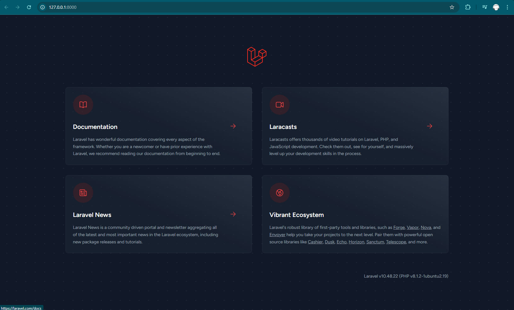
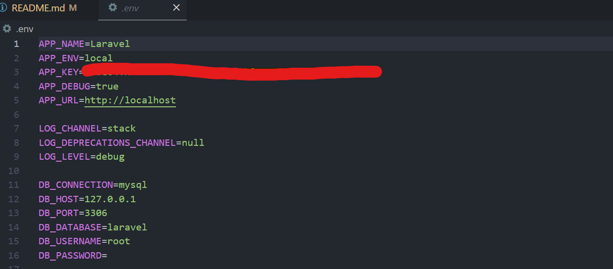
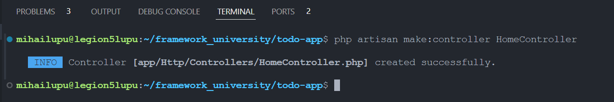
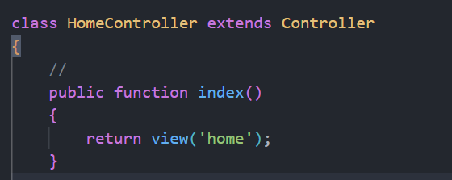
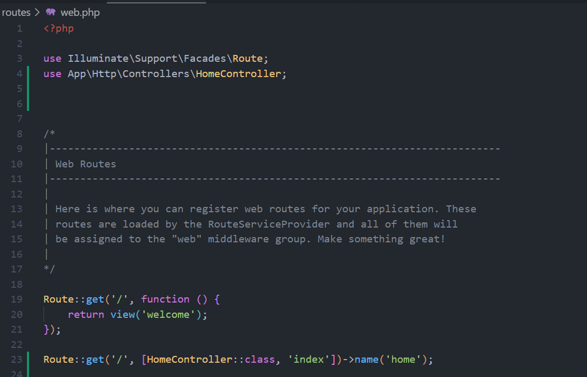
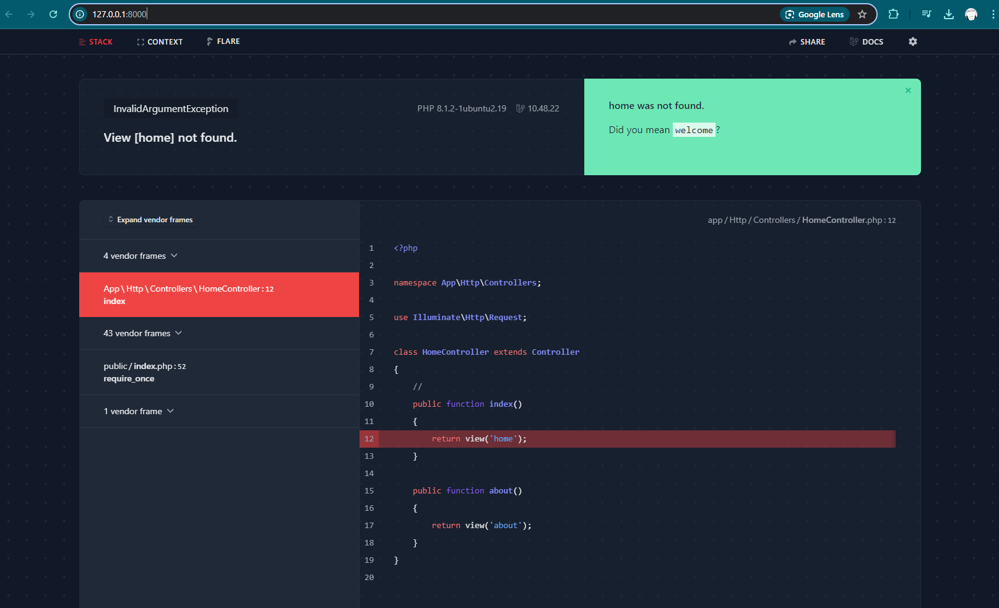
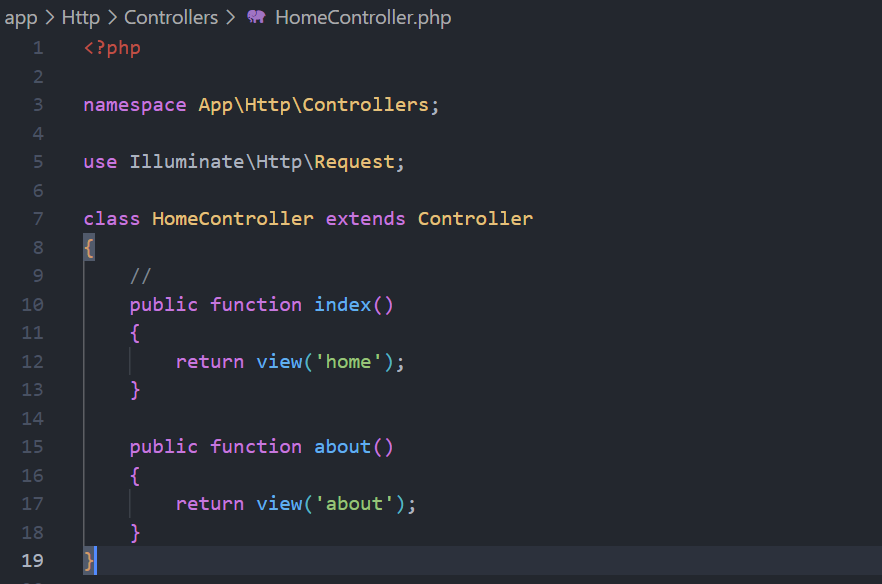
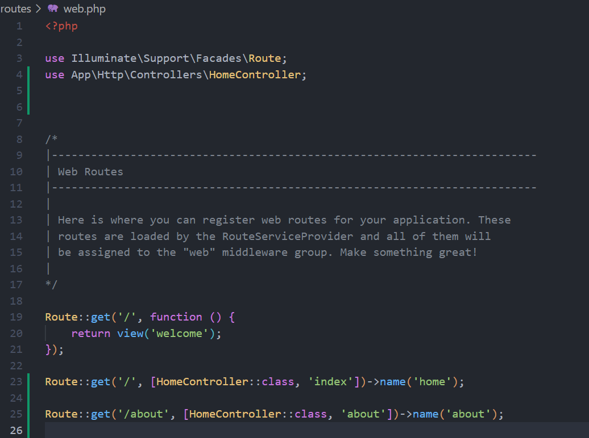
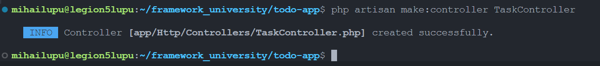

# Lucrare de laborator nr. 2. Cereri HTTP și șablonizare în Laravel

## Scopul lucrării

Să se studieze principiile de bază ale lucrului cu cererile HTTP în Laravel și șablonizarea folosind Blade, pe baza unei aplicații web „To-Do App pentru echipe” — o aplicație pentru gestionarea sarcinilor în cadrul unei echipe.

Aplicația este destinată unei echipe care dorește să își gestioneze sarcinile, să le atribuie membrilor și să monitorizeze starea și prioritatea sarcinilor (similar cu Github Issues).

## Condiții

## Nr. 1. Pregătirea pentru lucru, instalarea Laravel

1. Deschideți terminalul și creați un nou proiect Laravel cu numele todo-app (numele proiectului poate fi orice) folosind Composer: bash composer create-project laravel/laravel:^10 todo-app

-   

2. Intrați în directorul proiectului: bash cd todo-app

-   Am intrat în directoriu la pasul precedent.

3. Porniți serverul încorporat Laravel: bash php artisan serve Întrebare: Ce vedeți în browser când deschideți pagina http://localhost:8000?

-   Observam pagina default: 

## Nr. 2. Configurarea mediului

1. Deschideți fișierul .env și setați următoarele configurări ale aplicației: ini APP_NAME=ToDoApp APP_ENV=local APP_KEY= APP_DEBUG=true APP_URL=http://localhost:8000

-   

2. Generați cheia aplicației, care va fi utilizată pentru criptarea datelor: bash php artisan key:generate Întrebare: Ce s-ar întâmpla dacă această cheie ar ajunge pe mâna unui răufăcător?

-   Daca aceasta cheie ar ajunge pe mâna unui răufăcător atunci acesta ar putea decripta datele aplicații, compromite sesiunile utilizatorilor dar și efectua diferite tipuri de atacuri în funcție de își dorește acesta să obțină.

## Nr. 3. Principiile de bază ale lucrului cu cererile HTTP

### Nr. 3.1. Crearea rutelor pentru pagina principală și pagina "Despre noi"

1. Creați un controller HomeController pentru gestionarea cererilor către pagina principală

-   

2. Adăugați metoda index în HomeController, care va afișa pagina principală.

-   

3. Creați ruta pentru pagina principală în fișierul routes/web.php. php public function index() { return view('home'); }
   Deschideți browserul și accesați adresa http://localhost:8000. Asigurați-vă că pagina goală se încarcă, deoarece vizualizarea home.blade.php nu a fost încă creată.

-   
-   

4. În același controller HomeController, creați o metodă pentru pagina "Despre noi".

-   

5. Adăugați ruta pentru pagina "Despre noi" în fișierul routes/web.php.

-   

### Nr. 3.2. Crearea rutelor pentru sarcini

1. Creați un controller TaskController pentru gestionarea cererilor legate de sarcini și adăugați următoarele metode:
   index — afișarea listei de sarcini;
   create — afișarea formularului pentru crearea unei sarcini;
   store — salvarea unei sarcini noi;
   show — afișarea unei sarcini;
   edit — afișarea formularului pentru editarea unei sarcini;
   update — actualizarea sarcinii;
   destroy — ștergerea sarcinii.

-   
