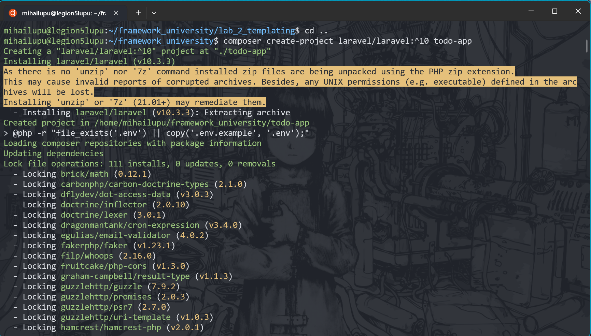

# Lucrare de laborator nr. 2. Cereri HTTP și șablonizare în Laravel

## Scopul lucrării

Să se studieze principiile de bază ale lucrului cu cererile HTTP în Laravel și șablonizarea folosind Blade, pe baza unei aplicații web „To-Do App pentru echipe” — o aplicație pentru gestionarea sarcinilor în cadrul unei echipe.

Aplicația este destinată unei echipe care dorește să își gestioneze sarcinile, să le atribuie membrilor și să monitorizeze starea și prioritatea sarcinilor (similar cu Github Issues).

## Condiții

## Nr. 1. Pregătirea pentru lucru, instalarea Laravel

1. Deschideți terminalul și creați un nou proiect Laravel cu numele todo-app (numele proiectului poate fi orice) folosind Composer: bash composer create-project laravel/laravel:^10 todo-app

-   
