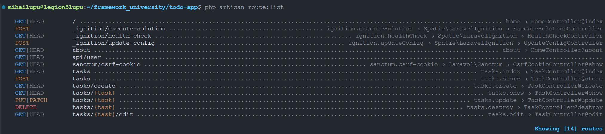
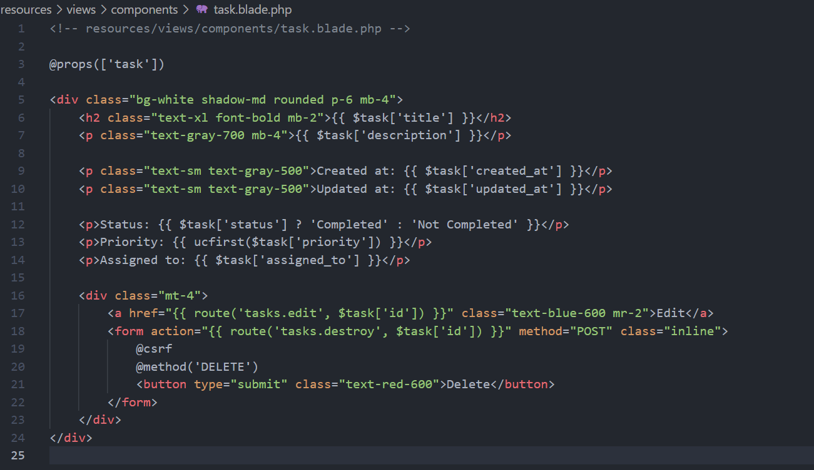

# Lucrare de laborator nr. 2. Cereri HTTP și șablonizare în Laravel

## Scopul lucrării

Să se studieze principiile de bază ale lucrului cu cererile HTTP în Laravel și șablonizarea folosind Blade, pe baza unei aplicații web „To-Do App pentru echipe” — o aplicație pentru gestionarea sarcinilor în cadrul unei echipe.

Aplicația este destinată unei echipe care dorește să își gestioneze sarcinile, să le atribuie membrilor și să monitorizeze starea și prioritatea sarcinilor (similar cu Github Issues).

## Condiții

## Nr. 1. Pregătirea pentru lucru, instalarea Laravel

1. Deschideți terminalul și creați un nou proiect Laravel cu numele todo-app (numele proiectului poate fi orice) folosind Composer: bash composer create-project laravel/laravel:^10 todo-app

-   

2. Intrați în directorul proiectului: bash cd todo-app

-   Am intrat în directoriu la pasul precedent.

3. Porniți serverul încorporat Laravel: bash php artisan serve Întrebare: Ce vedeți în browser când deschideți pagina http://localhost:8000?

-   Observam pagina default: 

## Nr. 2. Configurarea mediului

1. Deschideți fișierul .env și setați următoarele configurări ale aplicației: ini APP_NAME=ToDoApp APP_ENV=local APP_KEY= APP_DEBUG=true APP_URL=http://localhost:8000

-   

2. Generați cheia aplicației, care va fi utilizată pentru criptarea datelor: bash php artisan key:generate Întrebare: Ce s-ar întâmpla dacă această cheie ar ajunge pe mâna unui răufăcător?

-   Daca aceasta cheie ar ajunge pe mâna unui răufăcător atunci acesta ar putea decripta datele aplicații, compromite sesiunile utilizatorilor dar și efectua diferite tipuri de atacuri în funcție de își dorește acesta să obțină.

## Nr. 3. Principiile de bază ale lucrului cu cererile HTTP

### Nr. 3.1. Crearea rutelor pentru pagina principală și pagina "Despre noi"

1. Creați un controller HomeController pentru gestionarea cererilor către pagina principală

-   

2. Adăugați metoda index în HomeController, care va afișa pagina principală.

-   

3. Creați ruta pentru pagina principală în fișierul routes/web.php. php public function index() { return view('home'); }
   Deschideți browserul și accesați adresa http://localhost:8000. Asigurați-vă că pagina goală se încarcă, deoarece vizualizarea home.blade.php nu a fost încă creată.

-   
-   

4. În același controller HomeController, creați o metodă pentru pagina "Despre noi".

-   

5. Adăugați ruta pentru pagina "Despre noi" în fișierul routes/web.php.

-   

### Nr. 3.2. Crearea rutelor pentru sarcini

1. Creați un controller TaskController pentru gestionarea cererilor legate de sarcini și adăugați următoarele metode:
   index — afișarea listei de sarcini;
   create — afișarea formularului pentru crearea unei sarcini;
   store — salvarea unei sarcini noi;
   show — afișarea unei sarcini;
   edit — afișarea formularului pentru editarea unei sarcini;
   update — actualizarea sarcinii;
   destroy — ștergerea sarcinii.

-   
-   

2. Creați rutele pentru metodele controllerului TaskController în fișierul routes/web.php și specificați metodele HTTP corecte pentru fiecare rută.

-   

3. Utilizați gruparea rutelor pentru controllerul TaskController cu prefixul /tasks pentru a simplifica rutarea și a îmbunătăți lizibilitatea codului.

-   

4. Definiți nume corecte pentru rutele controllerului TaskController, de exemplu:
   tasks.index — lista de sarcini;
   tasks.show — afișarea unei sarcini individuale.

-   

5. Adăugați validarea parametrilor rutei id pentru sarcini. Asigurați-vă că parametrul id este un număr întreg pozitiv. Utilizați metoda where pentru a limita valorile parametrului id.

-   

6. În loc să creați manual rute pentru fiecare metodă, puteți folosi un controller de resurse, care va crea automat rute pentru toate operațiunile CRUD:
   În fișierul routes/web.php, înlocuiți crearea manuală a rutelor pentru controllerul TaskController cu un controller de resurse: php Route::resource('tasks', TaskController::class);
   Întrebare: Explicați diferența între crearea manuală a rutelor și utilizarea unui controller de resurse. Ce rute și ce nume de rute vor fi create automat?

-   

7. Verificați rutele create cu ajutorul comenzii php artisan route:list.

-   

## Nr. 4. Șablonizarea folosind Blade

### Nr. 4.1. Crearea unui layout pentru pagini

1. Creați un layout pentru paginile principale layouts/app.blade.php cu următoarele elemente comune ale paginii:
   Titlul paginii;
   Meniu de navigare;
   Conținutul paginii.

2. Folosiți directiva @yield pentru a defini zona în care va fi inserat conținutul diferitelor pagini.

### Nr. 4.2. Utilizarea șabloanelor Blade

1. Creați vizualizarea pentru pagina principală home.blade.php folosind layoutul layouts/app.blade.php în directorul resources/views.

-   

2. Pe pagina principală trebuie să fie:
   Mesaj de bun venit: titlu și o scurtă descriere a aplicației, de exemplu „To-Do App pentru echipe”.
   Navigație: linkuri către secțiunile principale, cum ar fi:
   Lista de sarcini;
   Crearea unei sarcini.
   Informații despre aplicație: o scurtă descriere a scopului aplicației și a principalelor sale funcții.

-   

3. Creați vizualizarea pentru pagina "Despre noi" — about.blade.php folosind layoutul layouts/app.blade.php în directorul resources/views.

-   

4. Creați vizualizări pentru sarcini cu următoarele șabloane în directorul resources/views/tasks:
   index.blade.php — lista de sarcini;
   show.blade.php — afișarea unei sarcini;
   ...

-   

5. Randați lista de sarcini pe pagina index.blade.php folosind date statice transmise din controller cu ajutorul directivei @foreach.

-   

### Nr. 4.3. Componente anonime Blade

1. Creați o componentă anonimă pentru afișarea antetului (header). Folosiți componenta creată în layoutul layouts/app.blade.php.

-   

2. Creați o componentă anonimă pentru afișarea sarcinilor:
   Componenta trebuie să fie simplă și să folosească parametri transmiși prin directiva @props. Acest lucru va face șabloanele mai flexibile și reutilizabile pe diverse pagini.
   Componenta trebuie să afișeze informații despre sarcină:
   Titlul sarcinii;
   Descrierea sarcinii;
   Data creării sarcinii;
   Data actualizării sarcinii;
   Acțiuni asupra sarcinii (editare, ștergere);
   Starea sarcinii (finalizată/nu este finalizată);
   Prioritatea sarcinii (scăzută/medie/ridicată);
   Responsabilul sarcinii (Assignment), adică numele utilizatorului căruia i-a fost atribuită sarcina.

-   
-   

3. Afișați componenta de sarcină creată pe pagina show.blade.php folosind parametrii transmiși.

-   
-   

### Nr. 4.4. Stilizarea paginilor

-   Pentru stilizarea paginilor am folosit biblioteca de stiluri Tailwind CSS.

## Nr. 5. Sarcini suplimentare

1. Afișați ultima sarcină creată pe pagina principală folosind View Composer.

-   

2. Creați o componentă anonimă suplimentară pentru afișarea priorității sarcinii (scăzută, medie, ridicată) cu culori sau pictograme diferite pentru fiecare prioritate.

-   
